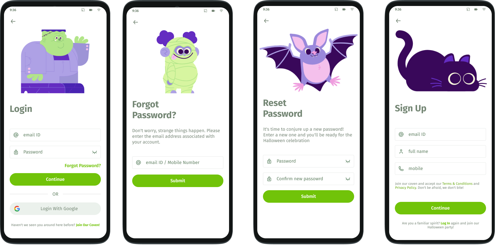

<div>
    
</div>

# Jetpack Compose Auth Screens

This repository contains a collection of Auth screens built using Jetpack Compose, a modern Android UI toolkit.

## Getting Started

### Prerequisites

- Android Studio Giraffe | 2022.3.1 Patch 4 (or later)
- Kotlin version: 1.7.20 (or later)
- Jetpack Compose version: 1.6.0-beta01 (or later)

### Running the Samples

1. Clone the repository:

   ```bash
   git clone https://github.com/DevHumbleChris/jetpack-compose-login-registration-samples.git
   ```

## Included Screens

1. **BasicLoginScreen**

   - _Description:_ A simple login screen with email, password, and other fields.

   

2. **Halloween**

   - _Figma Credits:_ Author: [@scaragrafostudi](https://www.figma.com/@scaragrafostudi)

   - _Description:_ Add a touch of Halloween to your auth screens screen. This project utilizes Figma designs created by [@scaragrafostudi](https://www.figma.com/@scaragrafostudi). Their creative work and attention to detail have greatly contributed to the visual aesthetics of this project.

   - Figma Designs:
     - [Figma File](<https://www.figma.com/file/f1ycwMo2IDH4Ig5OKfh8oz/Login-and-Sign-up-Screens-(Community)?type=design&node-id=103%3A350&mode=design&t=NKilFaZkVrQm7T0R-1>)

   
